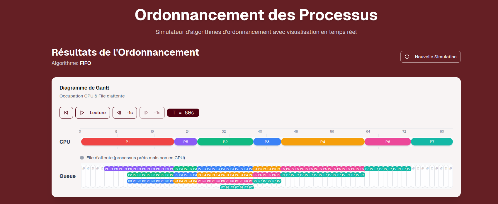
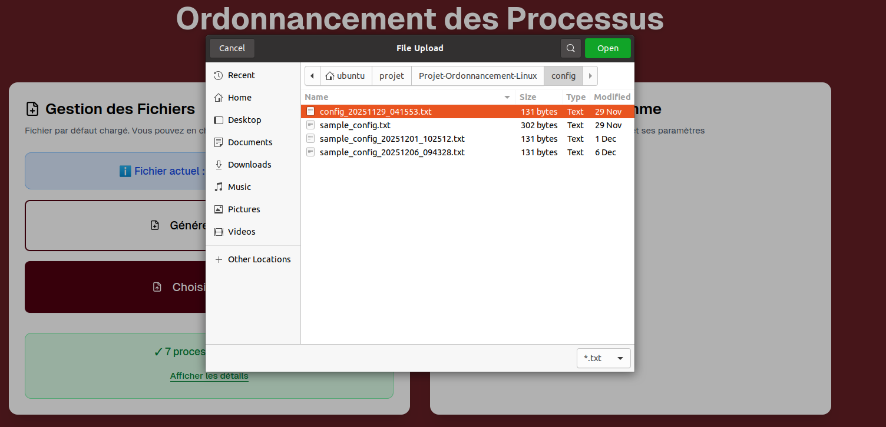

<div align="center" style="text-align: center;">

<br><br><br><br><br><br>

#                          **DOCUMENTATION TECHNIQUE**

##                   **Ordonnanceur Multitâche de Processus**
##                                **sous Linux**

<br><br><br>

### Mini-Projet : Systèmes d'Exploitation  
### Octobre - Décembre 2025

<br><br><br>

---

<br>

### **Équipe de Développement**

**Arij Sebai** • **Aya Sakroufi** • **Balkis Hanafi**  
**Hadil Hasni** • **Wiem Ayari**

<br><br>

---

<br><br>

**L'Institut séperieur d'informatique à Ariana**  
1ING3

<br><br><br><br><br><br>

</div>

<div style="page-break-after: always;"></div>

<div align="center">

## Table des Matières

</div>

### **1. Introduction** ................................................... [Page 4](#1-introduction)

### **2. Choix des Structures de Données** ......................... [Page 4](#2-choix-des-structures-de-données)
   - 2.1 Structure `process` : Le Cœur du Système
   - 2.2 Représentation des Données : Tableau Dynamique
   - 2.3 Représentation Implicite de la Ready Queue

### **3. Choix des Algorithmes d'Ordonnancement** ............... [Page 6](#3-choix-des-algorithmes-dordonnancement)
   - 3.1 FIFO (First-In First-Out)
   - 3.2 Priority Preemptive
   - 3.3 Round Robin (RR)
   - 3.4 SRT (Shortest Remaining Time First)
   - 3.5 Multilevel Queue (Statique)
   - 3.6 Multilevel Feedback Queue (Dynamique)

### **4. Technologies et Architecture** ........................... [Page 17](#4-technologies-et-architecture)
   - 4.1 Choix des Technologies
   - 4.2 Architecture du Projet  
   - 4.3 Backend C : Mode Interactif vs Mode API
   - 4.4 Intégration complète : Frontend Next.js + Backend C
   - 4.5 Flow d'Exécution Complet

### **5. Déroulement du Développement SCRUM** ................... [Page 19](#5-déroulement-du-développement-scrum)
   - 5.1 Organisation Équipe
   - 5.2 Paramètres Scrum
   - 5.3 Product Backlog
   - 5.4 Réunion de Lancement (Sprint 0)
   - 5.5 Sprint Backlog 1
   - 5.6 Sprint Backlog 2
   - 5.7 Métriques SCRUM

### **6. Spécifications Techniques** ................................ [Page 22](#6-spécifications-techniques)
   - 6.1 Point d'Entrée (main.c) : Modes Interactif et API
   - 6.2 Format Fichier Configuration
   - 6.3 Générateur Configuration Automatique
### **7. Makefile et Compilation** .................................. [Page 27](#7-makefile-et-compilation)
   - 7.1 Objectif du Makefile
   - 7.2 Variables Principales
   - 7.3 Règles Principales
   - 7.4 Déclaration PHONY
   - 7.5 Flags Compiler Expliqués
   - 7.6 Principes et Avantages
   - 7.7 Utilisation Pratique

### **8. Conclusion** ................................................. [Page 31](#8-conclusion)


<div style="page-break-after: always;"></div>

## 1. Introduction

### Objectif du Projet

Ce projet est un **simulateur d'ordonnancement de processus sous Linux** avec une architecture hybride moderne : **Frontend Next.js 16/React 19 + Backend C**.

**Capacités principales** :

- ✅ **6 algorithmes d'ordonnancement** : FIFO, Round-Robin, Priorité préemptive, SRT, Multilevel statique, Multilevel Dynamic (anti-famine)
- ✅ **Interface Web interactive** : sélection algorithme, paramètres dynamiques (quantum, ordre priorité), visualisations temps réel
- ✅ **Backend C performant** : moteur de simulation compilé, modes CLI interactif et API JSON
- ✅ **Visualisations riches** : Gantt chart interactif (play/pause/zoom), graphiques (pie/bar charts), tableau détaillé avec métriques
- ✅ **Générateur automatique** : création fichiers configuration aléatoires
- ✅ **Métriques complètes** : temps d'attente, temps total, finish time, makespan, CPU utilization
- ✅ **Architecture modulaire** : ajout nouvel algorithme = 1 fichier dans `policies/`, sans modifier scheduler.c


### 1.1 Galerie UI — Captures d'Écran de l'Application Web

> **📸 Galerie d'Images** : Les captures ci-dessous illustrent l'interface utilisateur complète de l'application en production.
>
> **Localisation** : Les fichiers PNG sont stockés dans le dossier `public/` à la racine du projet.

#### 1. Interface Principale


**Figure 1.1** — *Page d'accueil de l'application*
- Sélecteur d'algorithmes (dropdown avec 6 options : FIFO, RR, Priority, SRT, Multilevel, Multilevel Dynamic)
- Paramètres dynamiques : quantum (Round-Robin, Multilevel Dynamic), ordre de priorité (ascendant/descendant)
- Boutons d'action : Générer Config, Upload Fichier, Lancer Simulation
- Liste des processus chargés avec détails (ID, Arrival, Execution, Priority)

---

#### 2. Visualisations des Résultats



**Figure 1.2** — *Diagramme de Gantt interactif*
- Timeline horizontale avec processus colorés par ID (palette 20 couleurs)
- Contrôles de lecture : Play/Pause, Step Forward, Step Backward, Reset
- Zoom et navigation temporelle
- Légende automatique avec correspondance couleur-processus
- États visuels : Running (rempli), Waiting (hachuré), Completed (grisé)

---


**Figure 1.3a** — *Diagramme circulaire (Pie Chart)*
- Répartition du temps CPU par processus (pourcentages)
- Couleurs synchronisées avec le diagramme de Gantt
- Tooltip au survol avec temps exact

---


**Figure 1.3b** — *Graphique à barres (Bar Chart)*
- Comparaison temps d'attente (waiting) vs temps total (turnaround) par processus
- Axes : X = Process ID, Y = Time units
- Deux séries de barres colorées (waiting vs total)

---


**Figure 1.4** — *Tableau récapitulatif des statistiques*
- Colonnes : Process ID, Arrival Time, Execution Time, Wait Time, Finish Time, Priority, Turnaround
- Métriques globales : Average Wait Time, Makespan, CPU Utilization
- Tri par colonnes (cliquable)
- Export possible (copy/paste vers Excel)

---

#### 3. Fonctionnalités Avancées


**Figure 1.5** — *Dialog de génération automatique de configuration*
- Paramètres : Nombre de processus (1-50)
- Plages configurables : Arrival Time (min/max), Execution Time (min/max), Priority (min/max)
- Génération aléatoire avec prévisualisation du fichier `.txt`
- Bouton téléchargement direct

---



**Figure 1.6** — *Zone d'upload et validation de fichier*
- Drag & drop ou sélection fichier `.txt`
- Validation en temps réel de la syntaxe
- Aperçu des processus parsés en tableau
- Messages d'erreur détaillés si format invalide
- Bouton confirmation pour charger la configuration

---

## 2. Choix des Structures de Données

### 2.1 Justification des Structures Principales

#### Structure `process` : Le Cœur du Système

```c
#define NAME_LEN 64
#define READY 0
#define RUNNING 1
#define BLOCKED 2
#define ZOMBIE 3

struct process {
    char name[NAME_LEN];        // Identification unique
    int arrival_time;           // Moment d'arrivée en système
    int exec_time;              // Durée totale CPU requise (immuable)
    int priority;               // Priorité statique (PETITE VALEUR = HAUTE PRIORITÉ, convention Unix)
    int remaining_time;         // Temps restant à exécuter (modifiable)
    int waiting_time;           // Temps d'attente cumulé
    int status;                 // État : READY(0), RUNNING(1), BLOCKED(2), ZOMBIE(3)
    int end_time;               // Temps de fin d'exécution (pour métriques)
    int wait_time;              // Pour aging dynamique (Multilevel)
};
```


### 2.2 Représentation des Données : Tableau Dynamique

#### Structure Générale

```c
struct process *processes;  // Pointeur vers tableau dynamique
int num_processes;          // Nombre de processus chargés
```

**Allocation au runtime** :
```c
processes = malloc(num_processes * sizeof(struct process));
if (!processes) { /* erreur allocation */ }
```

### 2.3 Représentation Implicite de la Ready Queue

**On utilise une représentation implicite** :
```c
for (int i = 0; i < n; i++) {
    if (procs[i].arrival_time <= time && 
        procs[i].remaining_time > 0 && 
        procs[i].status == READY) {
        selected = i;
        break;
    }
}
```

#### Avantages de l'Approche Implicite

- ✅ **Zéro surcharge mémoire** supplémentaire
- ✅ **Code plus lisible** et directement mappable à l'OS réel
- ✅ **Flexibilité** : chaque politique définit son critère de "ready"
- ✅ **Pas de synchronisation** complexe entre structures

## 3. Choix des Algorithmes d'Ordonnancement

### 3.1 FIFO (First-In First-Out)

#### Principe

C'est une politique **non-préemptive**. Le processus arrivé le premier (`arrival_time` le plus bas) est sélectionné et s'exécute jusqu'à sa fin complète sans interruption.

#### Algorithme de Sélection et Simulation

**Étape 1 : Définir une fonction de sélection FIFO (fifo_scheduler)**

Cette fonction est responsable de trouver quel processus exécuter.

À l'intérieur de cette fonction :

**1.1. Préparer la recherche du processus éligible**
- Initialiser un indice "meilleur processus" à -1 (vide)
- Initialiser une variable "temps d'arrivée le plus tôt" à une valeur très élevée (INT_MAX)

**1.2. Parcourir tous les processus du système**
- **1.2.1.** Sélectionner uniquement les processus "prêts" : ceux qui sont déjà arrivés (`arrival_time <= time`) ET qui n'ont pas encore terminé (`remaining_time > 0`)
- **1.2.2.** Parmi ces processus prêts, comparer leur `arrival_time` avec le "temps d'arrivée le plus tôt" trouvé jusqu'à présent
- **1.2.3.** Si un processus est trouvé avec un `arrival_time` plus bas, le marquer comme le nouveau "meilleur processus"

**1.3. Retourner l'indice du processus le plus anciennement arrivé**
- Retourner l'index du "meilleur processus" (ou -1 si aucun processus n'est prêt)

**Étape 2 : Intégrer cette sélection dans la boucle principale de simulation**

À chaque unité de temps (`time`) :

**2.1. Gérer les nouvelles arrivées**
- Vérifier si de nouveaux processus arrivent à cet instant (`arrival_time == time`) et les marquer comme "prêts" (`status = READY`)

**2.2. Appeler la fonction de sélection (fifo_scheduler)**
- La fonction `fifo_scheduler` est appelée pour déterminer quel processus doit s'exécuter

**2.3. Logique Non-Préemptive**
- Tant que le processus en cours d'exécution n'est pas terminé, il restera celui avec le `arrival_time` le plus bas parmi tous les processus prêts
- Par conséquent, `fifo_scheduler` le re-sélectionnera à chaque tour, assurant qu'il n'est pas préempté par d'autres

**2.4. Exécuter le processus sélectionné**
- **2.4.1.** Si un processus est sélectionné (`next != -1`) :
  - Exécuter ce processus pendant une unité de temps (décrémenter `remaining_time`)
  - Si le processus termine (`remaining_time == 0`), le marquer comme "terminé" (`status = ZOMBIE`) et incrémenter le compteur global `completed`
- **2.4.2.** Sinon (si `next == -1`) :
  - Le processeur reste inactif (IDLE)

**2.5. Avancer le temps**
- Incrémenter `time` et répéter la boucle jusqu'à ce que tous les processus soient terminés (`completed == n`)

**Étape 3 : Générer les statistiques finales**

À la fin de la simulation, utiliser l'historique d'exécution (notamment `end_time` pour chaque processus) pour calculer et afficher :
- Le tableau de Gantt
- Le temps de fin
- Le temps d'attente : `end_time - arrival_time - exec_time`
- Le temps d'attente moyen

#### Avantages et Inconvénients

| Aspect | Évaluation |
|--------|-----------|
| ✅ **Très simple à implémenter** | Parfait pour comprendre le concept |
| ✅ **Zéro préemption** | Pas d'overhead context switch |
| ✅ **Déterministe** | Toujours même résultat |
| ✅ **Bon pour batch** | Tâches longues acceptées |
| ❌ **Très injuste** | Processus court doit attendre les longs |
| ❌ **Temps d'attente élevé** | Mauvais pour interactif |
| ❌ **Convoy effect** | Un processus long bloque tout le système |

#### Cas d'Usage Réel

**Linux/Unix** : Utilisé pour batch jobs, scripts de maintenance (quand démarrage en background via cron).


### 3.2 Priority Preemptive

#### Principe

À chaque instant, le processus le **plus prioritaire** **préempte immédiatement** tout processus en cours d'exécution.

**⚠️ Convention de Priorité** :
- **Mode Ascending (petite valeur = haute priorité)** 
- **Mode Descending (grande valeur = haute priorité)** 

#### Algorithme de Sélection et Simulation

**Étape 0 : Initialiser le mode de priorité**
- Récupérer le paramètre `prio_mode` (passé en CLI / API) :
  - `prio_mode = 0` → Ascending (petite valeur = haute prio)
  - `prio_mode = 1` → Descending (grande valeur = haute prio)
- **Défauts réels** :
  - CLI (interactif) : `prio_mode` démarre à **1 (descending)** dans `main.c`
  - API Next.js : la route passe `--prio-order asc` → `prio_mode = 0`

**Étape 1 : Définir une fonction de sélection préemptive**

Cette fonction permet de choisir le prochain processus à exécuter à chaque unité de temps.

À l'intérieur de cette fonction :

**1.1. Ignorer le processus actuellement en cours d'exécution**
- Cela permet une préemption immédiate si un meilleur processus devient disponible

**1.2. Préparer la recherche du processus le plus prioritaire**
- Initialiser un indice "meilleur processus" à -1 (vide)
- Initialiser une valeur extrême selon le mode :
  - Mode Ascending : `best_priority = INT_MAX` (on cherche le minimum)
  - Mode Descending : `best_priority = INT_MIN` (on cherche le maximum)

**1.3. Parcourir tous les processus**
- **1.3.1.** Sélectionner uniquement ceux qui sont arrivés (`arrival_time <= time`) ET n'ont pas encore terminé (`remaining_time > 0`)
- **1.3.2.** Comparer leur priorité selon le mode :
  - Mode Ascending : si `priority < best_priority` → nouveau meilleur candidat
  - Mode Descending : si `priority > best_priority` → nouveau meilleur candidat
- **1.3.3.** Mettre à jour `best_priority` et l'indice du meilleur processus

**1.4. Retourner l'indice du processus le plus prioritaire**
- Retourner -1 ("aucun processus prêt") si aucun n'est prêt

**Étape 2 : Intégrer cette sélection dans la boucle principale de simulation**

À chaque unité de temps :

**2.1. Appeler la fonction de sélection préemptive** pour déterminer quel processus exécuter

**2.2. Si un processus est sélectionné** :
- Exécuter ce processus pendant une unité de temps et décrémenter son temps restant

**2.3. Sinon** :
- Le processeur reste inactif (CPU IDLE)

**2.4. Incrémenter le temps et répéter** jusqu'à ce que tous les processus soient terminés

**Étape 3 : Générer les résultats finaux**

À la fin de la simulation, générer le diagramme de Gantt et les statistiques à partir de l'historique d'exécution.

#### Avantages et Inconvénients

| Aspect | Évaluation |
|--------|-----------|
| ✅ **Processus critiques prioritaires** | Parfait pour temps réel |
| ✅ **Flexible** | Modes ascendant/descendant |
| ✅ **Simple à implémenter** | Pas de structure complexe |
| ❌ **Processus faible priorité peuvent starver** | Risque famine |
| ❌ **Overhead context switches** | Dégradation performance si trop préemptions |
| ❌ **Pas équitable** | Processus longs = toujours peu servis |

#### Cas d'Usage Réel

**Systèmes temps réel dur** : Avionique, médical, contrôle industriel (processus critiques d'abord).


### 3.3 Round Robin (RR)

#### Principe

Chaque processus reçoit un **quantum** de temps fixe (configurable par l'utilisateur). Si le processus ne se termine pas après avoir consommé son quantum, il retourne en **fin de ready queue** et attend son prochain tour.

#### Algorithme de Sélection et Simulation

**Étape 1 : Initialisation**

- Créer une copie des processus pour ne pas modifier l'original
- Pour chaque processus :
  - `remaining_time = exec_time` (temps restant à exécuter)
  - `waiting_time = 0` (temps d'attente cumulé)
  - `end_time = -1` (marqueur de non-terminé)
- Initialiser le temps global à `0`
- Initialiser `completed = 0` (compteur de processus terminés)
- Créer une **file d'attente linéaire** (ready queue) avec indices `head` et `tail` initialisés à 0

**Étape 2 : Gestion de la Ready Queue**

À chaque itération de la boucle principale :

**2.1. Ajouter les nouveaux arrivants à la ready queue**

Parcourir tous les processus :
- **Critères d'ajout** :
  - `arrival_time == time` (processus qui arrive exactement à cet instant)
  - `remaining_time > 0` (processus non terminé)

- **Mécanisme d'ajout** :
  - Si les critères sont remplis → ajouter `ready[tail++] = i`
  - ⚠️ **Note d'implémentation** : Le code actuel n'implémente pas de vérification de duplication explicite, ce qui peut théoriquement causer des ajouts multiples si la logique de gestion de queue n'est pas rigoureuse

**2.2. Vérifier si la queue est vide**
- Si `head == tail` (queue vide, aucun processus prêt) :
  - Chercher le prochain `arrival_time` futur parmi les processus non terminés
  - Sauter directement à ce temps : `time = next_arrival`
  - Afficher : `"%4d  [IDLE]       []"`
  - Continuer à l'itération suivante

**Étape 3 : Sélection et Exécution du Processus**

**3.1. Extraire le processus en tête de file**
- `curr = ready[head]` (premier processus dans la queue, index dans le tableau)
- Incrémenter `head++` (retirer de la queue)

**3.2. Calculer le temps d'exécution effectif**
- `run = min(remaining_time, quantum)`
  - Si `remaining_time < quantum` → exécuter seulement le temps restant
  - Sinon → exécuter exactement le quantum complet

**3.3. Afficher l'état actuel**
- Format : `"%4d  %-8s    [ready_queue_content]"`
  - Temps actuel
  - Nom du processus en cours d'exécution
  - Contenu de la ready queue : `"name:remaining_time"` séparés par virgules

**3.4. Calcul du waiting_time**
- ⚠️ **Note d'implémentation** : Le temps d'attente est calculé à la fin de la simulation avec la formule :
  - `wait_time = finish - arrival_time - exec_time`
- Cette approche utilise le calcul final plutôt qu'une accumulation incrémentale pendant l'exécution

**3.5. Exécuter le processus**
- `remaining_time -= run` (décrémenter le temps restant)
- `time += run` (avancer le temps global de `run` unités)

**Étape 4 : Gestion des Nouveaux Arrivants Pendant le Quantum**

- Vérifier si de nouveaux processus arrivent pendant l'exécution du quantum
- **Condition** : `arrival_time > (time - run)` ET `arrival_time <= time`
  - C'est-à-dire arrivés entre le début et la fin de ce quantum
- **Critères supplémentaires** :
  - `remaining_time > 0` (non terminé)
  - `end_time == -1` (pas complété)
  - Pas déjà présent dans la queue (même vérification que 2.1)
- Si toutes les conditions sont remplies : ajouter à `ready[tail++]`

**Étape 5 : Replacer ou Terminer le Processus**

**5.1. Si le processus n'est pas terminé** (`remaining_time > 0`) :
- Le remettre **en fin de queue** : `ready[tail++] = curr`
- Il attendra son prochain tour (équité garantie)

**5.2. Si le processus est terminé** (`remaining_time == 0`) :
- Marquer `end_time = time` (temps de fin d'exécution)
- Incrémenter `completed++`
- **Ne pas remettre en queue**

**Étape 6 : Répéter jusqu'à Terminaison**

- Répéter les étapes 2 à 5 tant que `completed < n`

**Étape 7 : Calcul des Statistiques Finales**

Pour chaque processus (après terminaison de tous) :
- `finish = end_time` (temps de fin)
- `wait_time = finish - arrival_time - exec_time` (**formule exacte du temps d'attente**)
- Afficher : `"Name  Arrival  Exec  Finish  Wait"`
- Calculer `total_wait` (somme de tous les wait_time)
- Calculer `makespan = max(end_time)` (temps total de simulation)
- Afficher `Average Wait Time = total_wait / n`
- Afficher `Makespan`

#### Choix Optimal du Quantum

| Quantum | Impact CPU | Réactivité | Equité | Notes |
|---------|-----------|-----------|--------|-------|
| **1-2** | Très élevé | Excellente | Parfaite | Overhead inacceptable |
| **4** ✅ | Modéré | Bonne | Très bonne | **OPTIMAL TROUVÉ** |
| **8** | Bas | Moyenne | Bonne | Bon compromis aussi |
| **16+** | Minimal | Mauvaise | Basse | Devient comme FIFO |

#### Avantages et Inconvénients

| Aspect | Évaluation |
|--------|-----------|
| ✅ **ÉQUITÉ MAXIMALE** ✅ | Aucun processus attend indéfiniment |
| ✅ **Pas de famine** | Tous progressent |
| ✅ **Idéal pour interactif** | Bonne expérience utilisateur |
| ❌ Overhead modéré | Context switches nombreux |
| ❌ Quantum à tuner | Pas optimal pour tout workload |

#### Cas d'Usage Réel

**Linux** : CFS (Completely Fair Scheduler) basé sur ce principe. **Windows** : 20-100ms par processus selon priorité.

### 3.4 SRT (Shortest Remaining Time First - SRTF)

#### Principe

Ordonnancement **préemptif** basé sur le **temps restant le plus court**. À chaque unité de temps, le processus avec le `remaining_time` minimum s'exécute. Si un processus plus court arrive, il **préempte immédiatement** le processus en cours.

#### Algorithme de Sélection et Simulation

**Étape 1 : Initialisation**

- Créer une copie des processus pour ne pas modifier l'original
- Pour chaque processus :
  - `remaining_time = exec_time` (temps restant à exécuter)
  - `end_time = -1` (marqueur de non-terminé)
- Initialiser le temps global à `0`
- Initialiser `completed = 0` (nombre de processus terminés)

**Étape 2 : Boucle Principale de Simulation**

À **chaque unité de temps** (`time`) :

**2.1. Rechercher le Processus avec le Temps Restant Minimum**

Initialiser :
- `best = -1` (indice du meilleur processus)
- `min_rem = 999999` (temps restant minimum trouvé)

Parcourir tous les processus :
- **Critères de sélection** :
  - `arrival_time <= time` (processus déjà arrivé)
  - `remaining_time > 0` (processus non terminé)
  
- **Logique de sélection** :
  - Si `remaining_time < min_rem` → nouveau meilleur processus
  - Si `remaining_time == min_rem` → départager par `arrival_time` (FIFO pour égalité)
    - Sélectionner celui avec `arrival_time` le plus petit
  - Mettre à jour `min_rem` et `best`

**2.2. Gestion de l'État IDLE**

- Si `best == -1` (aucun processus prêt) :
  - CPU reste inactif (IDLE)
  - Afficher `[IDLE]`
  - Incrémenter `time` et continuer

**Étape 3 : Exécution du Processus Sélectionné**

**3.1. Affichage de l'état actuel**
- Afficher le processus en cours d'exécution
- Afficher la ready queue avec les `remaining_time` de chaque processus en attente

**3.2. Exécuter une unité de temps**
- `remaining_time--` (décrémenter d'1 unité)
- `time++` (avancer le temps global)

**Étape 4 : Vérification de la Terminaison**

- Si `remaining_time == 0` (processus vient de se terminer) :
  - Marquer `end_time = time` (temps de fin)
  - Incrémenter `completed`

**Étape 5 : Répéter**

- Répéter les étapes 2 à 4 tant que `completed < n`

**Étape 6 : Calcul des Statistiques Finales**

Pour chaque processus :
- `turnaround_time = end_time - arrival_time` (temps de rotation)
- `wait_time = turnaround_time - exec_time` (temps d'attente exact)
- Calculer la moyenne des temps d'attente
- Calculer le makespan (temps total de simulation)

#### Avantages et Inconvénients

| Aspect | Évaluation |
|--------|-----------|
| ✅ Temps attente très bon | Résultats excellents |
| ✅ Peu de préemptions | Comparé à Priority |
| ❌ **FAMINE des longs processus** ⚠️ | Processus long jamais sélectionné |
| ❌ Irréaliste en pratique | Pas possible en vrai système d'exploitation |

#### Cas d'Usage Réel

**Aucun en production** (requiert avenir). **Théorique uniquement**.

### 3.5 Multilevel Queue (Statique)

#### Principe

Cet algorithme gère les processus en respectant une **hiérarchie stricte de priorité**, tout en assurant une équité entre les processus de même rang grâce au tourniquet (**Round-Robin**).

**Convention de priorité** : Grande valeur = Haute Priorité (ex: 10 > 1)


#### Algorithme de Sélection (fonction `select_multilevel`)

**Entrées** :
- `procs[]` : tableau des processus
- `n` : nombre de processus
- `time` : temps actuel
- `current` : indice du processus actuellement en cours (-1 si aucun)
- `quantum_expired` : booléen indiquant si le quantum est expiré

**Étape 1 : Identifier la Priorité MAXIMUM des Processus Prêts** (convention : grande = haute)

Initialiser :
- `best_prio = -1` (très petite valeur, on cherche le maximum)
- `processes_ready = 0` (flag indiquant si au moins un processus est prêt)

Parcourir tous les processus :
- **Critères "Processus Prêt"** :
  - `arrival_time <= time` (déjà arrivé)
  - `remaining_time > 0` (pas encore terminé)
  
- Si processus prêt :
  - Si `priority > best_prio` → mettre à jour `best_prio` (on cherche la GRANDE valeur)
  - Marquer `processes_ready = 1`

Si aucun processus prêt (`processes_ready == 0`) → **Retourner -1 (CPU IDLE)**

**Étape 2 : Logique Round-Robin pour la Priorité MINIMUM**

**2.1. Vérifier si le processus courant peut continuer**

Si **toutes** les conditions suivantes sont vraies :
- `current != -1` (un processus est en cours)
- `procs[current].remaining_time > 0` (pas encore terminé)
- `procs[current].priority == best_prio` (a toujours la meilleure priorité = même valeur grande)
- `procs[current].arrival_time <= time` (toujours valide)
- `!quantum_expired` (quantum non expiré)

→ **Retourner `current`** (continuer le même processus = stabilité)

**2.2. Sinon, chercher le prochain candidat (Round-Robin circulaire)**

- Calculer `start_index = (current + 1) % n` (commencer juste après le processus courant)
- Parcourir circulairement tous les processus à partir de `start_index`

Pour `i = 0` à `n-1` :
- `idx = (start_index + i) % n` (parcours circulaire)
- Si processus `idx` est prêt ET a la priorité `best_prio` (même priorité maximum) :
  - **Retourner `idx`** (prochain processus à exécuter)

Si aucun candidat trouvé → **Retourner -1**

#### Avantages et Inconvénients

| Aspect | Évaluation |
|--------|-----------|
| ✅ Priorités fixes = déterministe | Comportement prévisible |
| ✅ Bon pour systèmes mixtes | Interactif + batch |
| ❌ **FAMINE des basses priorités** ⚠️ | Prio 2 peut attendre indéfiniment |
| ❌ Rigide | Pas d'adaptation aux changements |

#### Cas d'Usage Réel

**Unix v7, BSD, System V** (historique). **Problème** : Famine bien connue.

### 3.6 Multilevel Feedback Queue (Dynamique) ⭐ MODERNE

#### Principe

La politique **Multilevel Dynamic** utilise la même fonction de sélection que Multilevel Static (`select_multilevel_dynamic`), mais implémente un **mécanisme d'aging continu** dans la boucle de simulation pour éviter la famine.

**Différence clé avec Multilevel Static** :
- **Statique** : Les priorités restent fixes toute la simulation
- **Dynamique** : Les priorités augmentent automatiquement pour les processus en attente (anti-famine)

#### Algorithme de Sélection (fonction `select_multilevel_dynamic`)

**Entrées** :
- `procs[]` : tableau des processus
- `n` : nombre de processus
- `time` : temps actuel
- `current` : indice du processus actuellement en cours (-1 si aucun)
- `quantum_expired` : booléen indiquant si le quantum est expiré (`quantum_counter >= quantum`)

**Logique de sélection** :

**Étape 1 : Trouver la priorité MAXIMUM parmi les processus prêts** (convention : grande = haute)
- Initialiser `best_prio = -1` (valeur très petite)
- Parcourir tous les processus
- Si `arrival_time <= time` ET `remaining_time > 0` :
  - Si `priority > best_prio` → mettre à jour `best_prio` (on cherche la GRANDE valeur)
- Si aucun processus prêt → retourner -1 (IDLE)

**Étape 2 : Continuer le processus courant si possible**
- Si **toutes** les conditions suivantes sont vraies :
  - `current != -1` (un processus est en cours)
  - `procs[current].remaining_time > 0` (pas encore terminé)
  - `procs[current].priority == best_prio` (a toujours la meilleure priorité = même valeur grande)
  - `procs[current].arrival_time <= time` (toujours valide)
  - `!quantum_expired` (quantum non expiré)
- → Retourner `current` (continuer le même processus)

**Étape 3 : Sinon, Round-Robin circulaire**
- `start_index = (current + 1) % n`
- Parcourir circulairement de `start_index`
- Trouver le premier processus avec `priority == best_prio` (même priorité maximum)
- Retourner son indice (ou -1 si aucun)

#### Implémentation du Feedback Loop (boucle de simulation)

**La logique d'aging est implémentée dans `multilevel_dynamic_simulation()` du fichier `scheduler.c`.**

**Étape 1 : Initialisation**
- `current = -1` (aucun processus en cours)
- `quantum_counter = 0` (compteur de quantum)
- `time = 0`, `finished = 0`

**Étape 2 : Boucle principale (tant que `finished < n`)**

**2.1. Sélection du processus**
- Appeler `select_multilevel_dynamic(procs, n, time, current, quantum_counter >= quantum)`
- Si retourne -1 → CPU IDLE, incrémenter `time`, reset `quantum_counter = 0`, `current = -1`

**2.2. Affichage de l'état**
- Afficher le processus en cours d'exécution
- Afficher la ready queue avec format `"name:remaining_time"`

**2.3. Aging dynamique (Anti-Famine) ⭐ CLEF**

Pour **tous les processus en attente** (ceux qui NE sont PAS en cours d'exécution) :
- **Critères** : `i != idx` ET `arrival_time <= time` ET `remaining_time > 0`
- **Action** :
  - `priority++` (augmentation de priorité à chaque cycle)
  - `waiting_time++` (compteur d'attente)

**Mécanisme anti-famine** :
- Un processus en attente voit sa priorité augmenter **continuellement**
- Après suffisamment de cycles, il finira par atteindre la priorité maximum
- Il sera alors sélectionné par la fonction de sélection
- **Garantie** : Aucun processus ne peut attendre indéfiniment

**2.4. Exécution du processus sélectionné**
- `remaining_time--` (décrémenter d'1 unité)
- `current = idx` (marquer comme processus courant)
- `quantum_counter++` (incrémenter compteur de quantum)

**2.5. Vérification de terminaison**
- Si `remaining_time == 0` :
  - `end_time = time + 1`
  - `finished++`
  - `quantum_counter = 0` (reset)

**2.6. Gestion du quantum expiré**
- Si `quantum_counter >= quantum` :
  - `quantum_counter = 0` (reset pour permettre round-robin)
  - Le prochain appel à `select_multilevel_dynamic` aura `quantum_expired = true`
  - Permettra de passer au processus suivant de même priorité

**2.7. Avancer le temps**
- `time++`

**Étape 3 : Statistiques finales**

Afficher pour chaque processus :
- Name, Arrival, Exec, Finish, Wait
- **Final_Prio** (priorité finale après aging)

Calculer :
- Average Wait Time
- Makespan

#### Avantages et Inconvénients

| Aspect | Évaluation |
|--------|-----------|
| ✅ **Anti-famine** | Aging garantit personne n'attend indéfiniment |
| ✅ **Adaptation dynamique** | S'ajuste au comportement processus |
| ✅ **Équitable** | Meilleur que multilevel statique |
| ✅ **Moderne** | Inspiré Linux CFS réel |
| ⚠️ Complexité accrue | Plus de compteurs et conditions |
| ⚠️ Moins déterministe | Feedback rend résultats moins prévisibles |


## 4. Technologies et Architecture

### 4.1 Stack Technologique Complet

#### A. Frontend (Web UI Moderne)

| Technologie | Version | Rôle | Justification |
|-------------|---------|------|--------------|
| **Next.js** | 16.0.3 | Framework React SSR + routing | Production-ready, performance optimale |
| **React** | 19.2.0 | UI library composants | Modern hooks, state management |
| **TypeScript** | ^5 | Typage static | Sécurité types, refactoring facile |
| **Tailwind CSS** | ^4.1.9 | Utility-first CSS | Styling rapide, responsive design |
| **Radix UI** | ~1.x | Composants accessibles | Boutons, dialogs, tabs, forms |
| **Recharts** | latest | Visualisation données | Gantt, pie/bar charts interactifs |
| **Sonner** | ^1.7.4 | Toast notifications | Feedback utilisateur |
| **next-themes** | ^0.4.6 | Dark/Light theme | Thème UI persistant |
| **zod** | 3.25.76 | Validation schémas | Validation configs uploads |
| **React Hook Form** | ^7.60.0 | Gestion formulaires | Forms performantes |

#### B. Backend (Moteur Simulation C)

| Technologie | Version | Rôle | Justification |
|-------------|---------|------|--------------|
| **C** | C11 | Langage implémentation | Requis, bas niveau, performance |
| **GCC** | 9.4.0 | Compilateur | Standard Linux, optimisé |
| **Make** | 4.2.1 | Build automation | Compilation incrémentale |
| **POSIX** | Standard | API système | Portabilité Linux/Unix |

#### C. Build & Package Management (Frontend)

| Technologie | Version | Rôle | Justification |
|-------------|---------|------|--------------|
| **pnpm** | 10.24.0 | Package manager | Plus rapide/efficace que npm |
| **Node.js** | 20.19.6 | Runtime JavaScript | Exécution Next.js, APIs |
| **npm/corepack** | 10.8.2 | Package install | Gestion dépendances |
| **Turbopack** | Intégré | Bundler Next.js | Compilation ultra-rapide |
| **PostCSS** | ^8.5 | CSS processing | Tailwind compilation |

#### D. Tooling & Développement

| Technologie | Version | Rôle | Justification |
|-------------|---------|------|--------------|
| **VS Code** | Latest | IDE principal | Léger, plugins C/TypeScript/Git |
| **Git** | 2.x | Contrôle version | Collaboration, historique |
| **GitHub** | Cloud | Dépôt hébergé | Collaboration équipe, CI/CD |
| **ESLint** | 8.x (optionnel) | Linting JS | Qualité code (voir README) |

#### E. Architecture & Infrastructure

| Technologie | Rôle | Détails |
|-------------|------|---------|
| **Docker** (optionnel) | Containerisation | Reproductibilité environnement |
| **Linux/WSL2** | OS cible | Ubuntu 20.04 sur WSL/VM |
| **Port 3000** | Next.js dev server | http://localhost:3000 |
| **Child Process Spawn** | Backend invocation | Node.js exécute `./ordonnanceur --api` |

#### F. Interaction Frontend ↔ Backend

| Composant | Technologie | Communication |
|-----------|-------------|---------------|
| **Frontend (React)** | Next.js + TypeScript | HTTP POST requests |
| **API Route (Node.js)** | `app/api/*/route.ts` | child_process.spawn() |
| **Backend Binary (C)** | ./ordonnanceur --api | stdout JSON |
| **Response** | JSON over HTTP | JSON.parse() → React render |


### Tableau Récapitulatif - Stack par Couche

```
┌─────────────────────────────────────────────────────────────┐
│ FRONTEND (Web Browser)                                      │
│ Next.js 16 + React 19 + TypeScript + Tailwind + Radix UI  │
│ ├─ UI : components/algorithm-selector, results-display    │
│ ├─ Visualization : recharts (Gantt, Pie, Bar charts)      │
│ └─ HTTP Client : fetch → POST /api/schedule               │
└─────────────────────────────────────────────────────────────┘
                           ↓ HTTP (JSON)
┌─────────────────────────────────────────────────────────────┐
│ API ROUTES (Node.js Runtime)                                │
│ app/api/schedule/route.ts + parse-config/route.ts          │
│ ├─ Middleware : request validation, temp file creation     │
│ ├─ Process spawn : ./ordonnanceur --api --config ... --algo │
│ └─ Response : JSON parsing + cleanup                       │
└─────────────────────────────────────────────────────────────┘
                           ↓ child_process.spawn()
┌─────────────────────────────────────────────────────────────┐
│ BACKEND (C Binary)                                          │
│ ./ordonnanceur (GCC compiled, C11 standard)                 │
│ ├─ Parser : parse_config_file() → struct process[]        │
│ ├─ Scheduler : simulation engines (6 algorithms)           │
│ └─ Output : JSON to stdout (ganttData, processStats, etc.) │
└─────────────────────────────────────────────────────────────┘
```


### Versions Exactes du Projet

**Frontend Stack** :
```json
{
  "next": "16.0.3",
  "react": "19.2.0",
  "typescript": "^5",
  "tailwindcss": "^4.1.9",
  "recharts": "latest",
  "pnpm": "10.24.0",
  "node": "20.19.6"
}
```

**Backend Stack** :
```bash
C Compiler : gcc 9.4.0
Build Tool : make 4.2.1
C Standard : C11
Target OS  : Linux (any POSIX-compliant)
```

**Development Environment** :
```
OS       : Ubuntu 20.04 LTS (or WSL2)
IDE      : VS Code
VCS      : Git 2.x + GitHub
Runtime  : Node.js 20.19.6 (frontend)
          C runtime (backend)
```


### 4.2 Architecture du Dépôt Git

**Architecture Hybride : Next.js (Frontend) + C (Backend)**

```
Projet-Ordonnancement-Linux/
[github.com/arijsebai/Projet-Ordonnancement-Linux • branch: dev]

├─── 🎨 FRONTEND (Next.js 16 + React 19 + TypeScript)
│    ├── app/                                   # Next.js App Router
│    │   ├── page.tsx                          # Page principale
│    │   ├── layout.tsx                        # Layout racine
│    │   ├── globals.css                       # Styles globaux
│    │   └── api/
│    │       ├── schedule/route.ts             # POST /api/schedule
│    │       └── parse-config/route.ts         # POST /api/parse-config
│    │
│    ├── components/                           # React Components
│    │   ├── algorithm-selector.tsx
│    │   ├── file-generation-dialog.tsx
│    │   ├── results-display.tsx
│    │   ├── theme-provider.tsx
│    │   └── ui/                               # Shadcn UI (46 composants)
│    │
│    ├── lib/                                  # Utilitaires TypeScript
│    │   ├── types.ts                          # Interfaces/Types
│    │   └── utils.ts                          # Helpers
│    │
│    ├── hooks/                                # Hooks React
│    │   ├── use-toast.ts
│    │   └── use-mobile.ts
│    │
│    ├── public/                               # Assets statiques
│    │   ├── *.svg, *.png                      # Icons & favicons
│    │   ├── home.png, gantt.png, cercle.png   # Screenshots
│    │   ├── bar.png, tableau.png, fichier.png
│    │   └── gen-fichier.png
│    │
│    ├── node_modules/                         # Dependencies (gitignored)
│    ├── .next/                                # Cache Next.js (gitignored)
│    ├── next.config.mjs                       # Config Next.js
│    ├── tsconfig.json                         # Config TypeScript
│    ├── postcss.config.mjs                    # PostCSS config
│    ├── components.json                       # Shadcn UI config
│    ├── next-env.d.ts                         # Auto-généré Next.js types
│    └── .vscode/                              # VS Code settings
│
├─── 🔧 BACKEND C (Moteur simulation)
│    ├── src/                                  # Code source C11
│    │   ├── main.c                            # Point d'entrée
│    │   ├── scheduler.c                       # Moteur simulation
│    │   ├── parser.c                          # Parser config
│    │   ├── generate_config.c                 # Générateur config
│    │   └── utils.c                           # Utilitaires
│    │
│    ├── include/                              # Headers C
│    │   ├── process.h
│    │   ├── scheduler.h
│    │   ├── parser.h
│    │   ├── generate_config.h
│    │   └── utils.h
│    │
│    ├── policies/                             # 6 Algorithmes
│    │   ├── fifo.c
│    │   ├── priority_preemptive.c
│    │   ├── roundrobin.c
│    │   ├── srt.c
│    │   ├── multilevel.c
│    │   └── multilevel_dynamic.c
│    │
│    ├── tests/                                # Tests unitaires C
│    │   ├── test_fifo.c
│    │   ├── test_priority.c
│    │   ├── test_roundrobin.c
│    │   ├── test_multilevel.c
│    │   ├── test_multilevel_dynamic.c
│    │   ├── test_parser.c
│    │   └── testfile.txt
│    │
│    ├── Makefile                              # Build system C
│    ├── ordonnanceur                          # Binaire Linux (49 KB)
│    └── ordonnanceur.exe                      # Binaire Windows (504 KB)
│
├─── 📦 BUILD & COMPILATION
│    ├── build/                                # Fichiers objets .o
│    │   ├── *.o (11 fichiers)                 # fifo.o, scheduler.o, parser.o, etc.
│    │   └── Générés par: make
│    │
│    └── (test_* binaries ignorés par .gitignore)
│
├─── ⚙️ CONFIGURATION & DONNÉES
│    ├── config/                               # Fichiers configuration
│    │   ├── sample_config.txt                 # Config exemple
│    │   └── config_*.txt                      # Configs générées
│    │
│    ├── package.json                          # Dependencies Node.js
│    ├── pnpm-lock.yaml                        # Lock file
│    ├── tsconfig.json                         # Config TypeScript
│    ├── next.config.mjs                       # Config Next.js
│    ├── postcss.config.mjs                    # PostCSS config
│    ├── components.json                       # Shadcn UI config
│    ├── Makefile                              # Build C
│    ├── .gitignore                            # Fichiers ignorés
│    ├── next-env.d.ts                         # Types Next.js auto-générés
│    └── .git/                                 # Dépôt Git local
│
└─── 📚 DOCUMENTATION
     ├── Documentation.md                      # Documentation technique (1857 lignes)
     ├── Documentation.pdf                     # Version PDF auto-générée
     ├── ANALYSE_LICENCES.pdf                  # Analyse des licences du projet
     ├── README.md                             # Guide utilisateur
     ├── LICENSE                               # MIT License
     └── .vscode/                              # VS Code settings
```

**Métadonnées Dépôt GitHub** :

| Propriété | Valeur |
|-----------|--------|
| **URL** | `github.com/arijsebai/Projet-Ordonnancement-Linux` |
| **Owner** | `arijsebai` |
| **Branch actif** | `dev` |
| **Licence** | MIT |
| **Package** | `my-v0-project` v0.1.0 |
| **Binaires** | `ordonnanceur` (Linux), `ordonnanceur.exe` (Windows) |

**Structure Logique par Rôle**

```
┌─────────────────────────────────────────────────┐
│  UTILISATEUR (Browser)                          │
│  http://localhost:3000                          │
└──────────────────┬──────────────────────────────┘
                   │
        ┌──────────▼────────────┐
        │  FRONTEND (React)     │
        │  ├─ page.tsx          │
        │  ├─ AlgorithmSelector │
        │  ├─ FileGeneration    │
        │  └─ ResultsDisplay    │
        └──────────┬────────────┘
                   │ POST /api/schedule
        ┌──────────▼────────────────────┐
        │  API Route (Node.js)          │
        │  /api/schedule/route.ts       │
        │  ├─ mapAlgorithm()            │
        │  ├─ spawn("./ordonnanceur", [--api, --config <tmp>, --algo <name>, --quantum <q>, --prio-order <asc|desc>]) │
        │  └─ parse JSON stdout         │
        └──────────┬────────────────────┘
                   │
        ┌──────────▼────────────────┐
        │  BACKEND (C Binary)       │
        │  ./ordonnanceur --api     │
        │  ├─ parser.c (parse)      │
        │  ├─ scheduler.c (simu)    │
        │  └─ JSON stdout output    │
        └──────────┬────────────────┘
                   │
        ┌──────────▼────────────┐
        │  API Route            │
        │  Parse JSON + Return  │
        └──────────┬────────────┘
                   │
        ┌──────────▼────────────────┐
        │  React Component         │
        │  ResultsDisplay          │
        │  ├─ Gantt chart          │
        │  ├─ Pie/Bar charts       │
        │  └─ Detailed table       │
        └──────────────────────────┘
```

### 4.3 Backend C : Modes d'Opération

Le backend C (`ordonnanceur`) supporte **3 modes** :

| Mode | Commande | Output | Cas d'Usage |
|------|----------|--------|-----------|
| **Interactif** | `./ordonnanceur` | Texte + Gantt textuel | CLI local, démo |
| **Direct File** | `./ordonnanceur config.txt` | Texte + Gantt textuel | Scripts shell |
| **API** | `./ordonnanceur --api --config ... --algo ...` | JSON structuré | Routes Next.js |
| **Parse Only** | `./ordonnanceur --parse-config config.txt` | JSON array | Validation fichiers |


### 4.4 Intégration Frontend ↔ Backend

#### Flow complet : User → React → API Route → C Backend → Results

```
User (Browser)
    ↓ Sélectionne algorithme + paramètres
React Component (page.tsx)
    ↓ POST /api/schedule avec { processes, config }
API Route (app/api/schedule/route.ts)
    ↓ Écrit fichier temp + spawn("./ordonnanceur --api ...")
C Backend (ordonnanceur)
    ↓ Parse → Simulate → JSON stdout
API Route
    ↓ Parse JSON + cleanup temp file
React Component (ResultsDisplay)
    ↓ Affiche Gantt + Charts + Table
```

**Routes API Next.js** :

1. **POST /api/parse-config** : Upload fichier `.txt` → retourne array processes
2. **POST /api/schedule** : Lance simulation → retourne résultats complets


### 4.5 Flow d'Exécution Complet

### 4.5 Visualisations Frontend

**Components React** :

1. **AlgorithmSelector** (`components/algorithm-selector.tsx`)
   - Dropdown 6 algorithmes
   - Paramètres dynamiques : quantum (RR, Multilevel Dynamic), priorityOrder (Priority)

2. **ResultsDisplay** (`components/results-display.tsx`)
   - **Gantt chart** : timeline interactif (play/pause, step, zoom)
   - **Pie chart** : répartition CPU par processus
   - **Bar chart** : temps attente vs temps total
   - **Table** : stats détaillées (arrival, execution, wait, finish, priority)
   - **Couleurs** : 20 couleurs distinctes, déterministe par process ID

3. **FileGenerationDialog** (`components/file-generation-dialog.tsx`)
   - Dialog création config (nb processus, ranges arrival/exec/priority)
   - Prévisualisation avant téléchargement
   - Génération aléatoire avec paramètres

> ⚠️ **Note** : Les captures d'écran de l'interface utilisateur sont documentées dans la **section 1.1** (Galerie UI) avec les vrais fichiers d'écran actuels.


### 4.6 Mapping Algorithmes Frontend → Backend


## 5. Déroulement du Développement SCRUM

### 5.1 Organisation Équipe

| Rôle | Responsable(s) |
|------|----------------|
| **Product Owner** | Mme Yosra Najar |
| **Scrum Master** | Arij Sebai |
| **Développeuses** | Aya Sakroufi, Balkis Hanafi, Hadil Hasni, Wiem Ayari |

### 5.2 Paramètres Scrum

| Paramètre | Valeur |
|-----------|--------|
| **Durée totale** | 5 semaines |
| **Durée sprint** | 2 semaine (12 jours ouvrables) |
| **Nombre sprints** | 2 sprints |
| **Réunions** | Planning (1h), Daily (15min), Review (1h), Retro (45min) |
| **Total Story Points** | ~180 SP |

### 5.3 Product Backlog

| ID | User Story | Priorité |
|----|-----------|----------|
| **1** | En tant qu'utilisateur, je veux lire un fichier de configuration contenant les processus (nom, arrivée, durée, priorité) | Moyenne |
| **2** | En tant que développeur, je veux un Makefile fonctionnel | Haute |
| **3** | En tant qu'utilisateur, je veux simuler un ordonnancement FIFO | Moyenne |
| **4** | En tant qu'utilisateur, je veux simuler un ordonnancement Round Robin | Haute |
| **5** | En tant qu'utilisateur, je veux simuler un ordonnancement à priorité préemptive | Haute |
| **6** | En tant qu'utilisateur, je veux voir les résultats sur la console (temps d'attente, temps de retour, Gantt textuel) | Moyenne |
| **7** | En tant qu'utilisateur, je veux choisir dynamiquement l'algorithme d'ordonnancement | Moyenne |
| **8** | En tant qu'utilisateur, je veux une politique multilevel avec aging | Haute |
| **9** | En tant qu'utilisateur, je veux une politique SRT (Shortest Remaining Time) | Haute |
| **10** | En tant qu'utilisateur, je veux automatiser la génération d'un fichier de configuration | Moyenne |
| **11** | En tant qu'utilisateur, je veux un affichage graphique (diagramme de Gantt) | Haute |
| **12** | En tant qu'utilisateur, je veux une interface graphique simple (IHM) | Haute |

### 5.4 Réunion de Lancement (Sprint 0)

**Objectif** : Préparer le projet et établir les fondations

**Tâches essentielles** :

1. **Lire et comprendre le sujet**
   - Analyser les spécifications du projet
   - Identifier les cas d'usage
   - Clarifier les ambiguïtés

2. **Identifier les fonctionnalités minimales et avancées**
   - **Minimales** : FIFO, Priority, RR, affichage console
   - **Avancées** : Multilevel, SRT, Gantt graphique, IHM

3. **Créer le dépôt GitHub + choisir la licence (MIT)**
   - Initialiser git local
   - Créer dépôt GitHub
   - Ajouter LICENSE MIT
   - Configurer .gitignore
   - Premier commit


### 5.5 Sprint Backlog 1

**Objectif** : Implémenter ordonnanceurs de base et infrastructure

| # | Tâche | Charge | Estimation |
|----|-------|--------|------------|
| **1** | Conception du fichier de configuration des processus | 3 pts | 4.5 h |
| **3** | Développement de la politique FIFO | 5 pts | 7.5 h |
| **4** | Développement de Round Robin (gestion du quantum) | 8 pts | 12 h |
| **5** | Développement de la politique à priorité préemptive | 8 pts | 12 h |
| **2** | Création du Makefile (build / clean) | 4 pts | 6 h |
| **6** | Affichage textuel des résultats (temps d'attente, temps de retour, Gantt textuel) | 3 pts | 4.5 h |
| **7** | Initialisation du dépôt GitHub | 1 pt | 1.5 h |
| **10** | Ajout d'exemples de tests simples | 2 pts | 3 h |

**Total Sprint 1** : **34 points** (**50.5 heures**)

### 5.6 Sprint Backlog 2

**Objectif** : Implémenter algorithmes avancés et interface utilisateur

| Tâche | Description | Charge | Priorité | Estimation |
|-------|-----------|--------|----------|------------|
| **Multilevel + Aging** | Ajouter un ordonnancement multi-files avec mécanisme d'aging | 8 pts | Haute | 12 h |
| **SRT** | Version préemptive de SJF (gestion du temps restant) | 8 pts | Haute | 12 h |
| **Génération Config** | Script/programme produisant un fichier valide automatiquement | 4 pts | Moyenne | 6 h |
| **IHM + Gantt** | IHM basique + génération d'un diagramme de Gantt visuel | 12 pts | Haute | 18 h |

**Total Sprint 2** : **32 points** (**48 heures**)

### 5.7 Métriques SCRUM - Sprints 0, 1, 2

#### Récapitulatif Charges

| Sprint | Objectif | Points | Heures | Tâches |
|--------|----------|--------|--------|--------|
| **Sprint 0** | Réunion de lancement | N/A | 3 | 3 |
| **Sprint 1** | FIFO + Foundation | 34 | 50.5 | 8 |
| **Sprint 2** | Algorithmes avancés | 32 | 48 | 4 |
| **TOTAL** | | **66** | **101.5** | **15** |

## 6. Spécifications Techniques : Point d'Entrée, Parser et Générateur

### 6.1 Point d'Entrée (main.c) : Modes Interactif et API

#### Vue d'ensemble des Modes d'Opération

Le backend C (`ordonnanceur`) supporte **3 modes d'opération** :

| Mode | Commande | Utilisateur | Output | Cas d'Usage |
|------|----------|-----------|--------|-----------|
| **Interactif** | `./ordonnanceur` | Humain | Texte + Gantt textuel | CLI local |
| **Direct File** | `./ordonnanceur [fichier]` | Humain | Texte + Gantt textuel | Script shell rapide |
| **API** | `./ordonnanceur --api --config ... --algo ...` | Programme/Script | JSON structuré | Routes Next.js |
| **Parse Only** | `./ordonnanceur --parse-config [fichier]` | Programme/Script | JSON array | Validation fichiers |


#### Mode 1 : CLI Interactif (Menu Principal)

#### Étapes du Programme Principal (Mode Interactif)

**Étape 0 : Détection du Mode d'Opération**

À la première ligne de `main()` :
- **Si aucun argument** (`argc == 1`) → Mode Interactif (menu)
- **Si un argument non-flag** (`argc == 2` et `argv[1][0] != '-'`) → Mode Direct File (fichier passé directement)
- **Si flags détectés** (`--api`, `--parse-config`, `--config`) → Mode API (sortie JSON)

```c
if (argc == 2 && argv[1][0] != '-') {
    direct_file_mode = 1;  // Mode: ./ordonnanceur config.txt
    strncpy(filename, argv[1], sizeof(filename) - 1);
}
```

Ensuite, parcourir tous les arguments pour capturer les flags API :
```c
for (int i = 1; i < argc; i++) {
    if (strcmp(argv[i], "--api") == 0) { api_mode = 1; }
    else if (strcmp(argv[i], "--parse-config") == 0) { parse_only = 1; }
    else if (strcmp(argv[i], "--config") == 0) { /* read filename */ }
    else if (strcmp(argv[i], "--algo") == 0) { /* read algo name */ }
    else if (strcmp(argv[i], "--quantum") == 0) { /* read quantum */ }
    else if (strcmp(argv[i], "--prio-order") == 0) { /* read asc|desc */ }
}
```

**Étape 1 : Affichage du Menu Interactif**

- Afficher le titre : `=== Scheduler Project ===`
- Afficher les deux options :
  - Option 1 : "Generate configuration file automatically (default)"
  - Option 2 : "Use an existing configuration file"
- Demander le choix de l'utilisateur : `Your choice (press ENTER for default): `
- Utiliser `fgets()` pour lire l'entrée (sûr contre débordement de buffer)
- **Validation** :
  - Si entrée vide (juste ENTER) → choix par défaut = 1
  - Si entrée = "1" ou "2" → utiliser ce choix
  - Sinon → avertissement et défaut = 1

**Étape 2 : Gestion du Choix 1 (Générer Configuration)**

- Récupérer timestamp système :
  - Appeler `time(NULL)` pour obtenir temps actuel
  - Appeler `localtime()` pour convertir en structure `tm`
  - Utiliser `strftime(format, ...)` avec pattern `"%Y%m%d_%H%M%S"` (ex: `20251206_143022`)

- Construire le chemin complet :
  - Format : `"config/sample_config_TIMESTAMP.txt"`
  - Exemple : `config/sample_config_20251206_143022.txt`
  - Utiliser `snprintf()` pour formater de manière sûre

- Appeler `generate_config(filename)` :
  - Passe le chemin au générateur
  - Si retourne 0 → succès
  - Si retourne erreur → afficher message d'erreur et quitter (return 1)

**Étape 3 : Gestion du Choix 2 (Charger Fichier Existant)**

- Demander : `Enter configuration file name (with path if needed): `
- Lire le nom du fichier avec `scanf("%255s", filename)` :
  - Limite : 255 caractères (sécurité buffer)
  - Accepte chemins avec sous-répertoires (ex: `config/sample_config.txt`)

- **Nettoyage du buffer stdin** :
  - Après `scanf()`, le caractère newline reste dans le buffer
  - Boucle de nettoyage : `while ((c = getchar()) != '\n' && c != EOF);`
  - Essentiel avant utilisation de `fgets()` ultérieurement

**Étape 4 : Affichage du Fichier de Configuration**

- Afficher message : `Loading configuration file: <filename>`
- Appeler `display_config_file(filename)` pour afficher le contenu brut du fichier
- Permet à l'utilisateur de vérifier avant parsing

**Étape 5 : Parsing et Chargement des Processus**

- Allouer un pointeur : `struct process *list = NULL`
- Initialiser compteur : `int n = 0`
- Appeler `parse_config_file(filename, &list, &n)` :
  - Remplit le tableau `list` avec les processus trouvés
  - Remplit `n` avec le nombre de processus chargés
  - Retourne 0 si succès, erreur sinon
- Si erreur (return != 0) :
  - Afficher message d'erreur
  - Quitter (return 1)

- Afficher succès : `✔ N processes loaded.`

**Étape 6 : Chargement des Politiques d'Ordonnancement**

- Appeler `load_policies()` :
  - Initialise la liste des politiques disponibles
  - Enregistre les fonctions de sélection (FIFO, Priority, RR, SRT, Multilevel, etc.)

**Étape 7 : Menu de Sélection de Politique**

- Appeler `choose_policy()` :
  - Affiche les politiques disponibles avec numéros
  - Demande à l'utilisateur de choisir
  - Retourne l'indice de la politique choisie

**Étape 8 : Lancer la Simulation**

- Appeler `run_scheduler(list, n, policy)` :
  - Lance la simulation avec les processus et la politique choisis
  - Orchestre la boucle temps dans `scheduler.c`
  - Affiche les résultats (tableau, statistiques, Gantt)

**Étape 9 : Libération Mémoire et Terminaison**

- Appeler `free(list)` pour libérer le tableau de processus
- Retourner 0 (succès)

---

#### Mode 2 : Direct File Mode (Fichier en Arguments)

**Comportement** : `./ordonnanceur config/sample_config.txt`

**Différence avec Mode Interactif** :
- Saute le menu initial
- Charge directement le fichier fourni en argument
- Affiche le contenu du fichier
- Affiche le menu de sélection de politique
- Exécute la simulation et affiche résultats (texte + Gantt)

**Avantage** : Utile pour scripts shell automatisés sans intervention utilisateur.


#### Mode 3 : API Mode (Mode Programmable JSON)

**Comportement** : `./ordonnanceur --api --config <file> --algo <algo> [--quantum <q>] [--prio-order <asc|desc>]`

**Ou en cas de Parse Only** : `./ordonnanceur --parse-config <file>`

**Différence avec Modes Interactifs** :
- Aucune interaction utilisateur
- Sortie **UNIQUEMENT** JSON structuré sur stdout
- Pas d'affichage de menu, pas de Gantt textuel
- Erreurs en JSON format (pour faciliter parsing)
- Conçu pour appels programmatiques

**Étapes Internes (Mode API)** :

1. **Parsing des flags** (déjà fait à Étape 0)
2. **Vérification si parse_only** :
   - Si oui : parser le fichier → retourner JSON array des processus → terminer
   - Si non : continuer au scheduler
3. **Vérification si api_mode** :
   - Si non : mode interactif classique
   - Si oui : continuer mode API
4. **Chargement de la configuration** :
   - Appeler `parse_config_file(config_path, &list, &n)`
   - Si erreur : `printf("{\"error\":\"Failed to parse config\"}\n")`
5. **Création de la structure d'options** :
   ```c
   struct scheduler_options opts = {
       .algorithm = algo,        // "fifo", "priority", "roundrobin", etc.
       .quantum = quantum,       // pour RR et multilevel_dynamic
       .prio_mode = prio_mode    // 0 = asc, 1 = desc
   };
   ```
6. **Appel au scheduler mode API** :
   - Appeler `run_scheduler_api(list, n, &opts, &result)`
   - Cette fonction remplit `result` avec :
     - `gantt_segment[]` : allocation CPU par temps
     - `process_stat[]` : statistiques par processus
     - `average_wait`, `makespan` : métriques globales
7. **Sortie JSON** :
   - Appeler `print_json_result(&result)`
   - Affiche JSON structuré sur stdout
   - API route Next.js parse ce JSON

### 6.2 Format Fichier Configuration

#### Syntaxe Générale

Chaque ligne représente soit :
- Un **processus valide** : 4 champs séparés par espaces ou tabulations
- Une **ligne vide** : ignorée
- Un **commentaire** : ignoré

#### Ordre des Champs (Obligatoire)

| Position | Champ | Type | Contraintes |
|----------|-------|------|-------------|
| 1 | `name` | Chaîne | Sans espaces (ex: P1, processA) |
| 2 | `arrival_time` | Entier | >= 0 |
| 3 | `exec_time` | Entier | > 0 (strictement positif) |
| 4 | `priority` | Entier | Intervalle selon contexte |

#### Règles Commentaires

- **Commentaire entier** : Ligne commençant par `#` → ignorée complètement
- **Commentaire en fin de ligne** : Tout ce qui suit `#` → ignoré

#### Exemple Complet

```
# Configuration exemple processus
P1 0 250 3       # Processus 1, arrive t=0, durée 250ms, prio 3
P2 10 100 1      # Processus 2, arrive t=10, durée 100ms, prio 1
P3 20 150 0      # Processus 3, arrive t=20, durée 150ms, prio 0

# Ligne vide ci-dessus = ignorée

P4 20 50 5       # Valide
# P5 25 75 2     # Commentaire entier → ignoré complètement
P6 30 200 2 # Commentaire fin ligne → ignoré

P7	40	100	1	# Tabulations acceptées
```

#### Algorithme de Parsing Détaillé

**Étape 1 : Initialisation**
- Ouvrir le fichier de configuration en mode lecture
- Allouer un tableau dynamique de processus (capacité initiale : 16 éléments)
- Initialiser compteur de processus à 0
- Initialiser numéro de ligne à 0

**Étape 2 : Lecture ligne par ligne**

Pour chaque ligne du fichier :

**2.1. Pré-traitement de la ligne**
- Supprimer le caractère de fin de ligne `\n` si présent
- Identifier le premier caractère non-blanc
- Si la ligne est entièrement vide → ignorer et passer à la suivante
- Si le premier caractère est `#` → ligne commentaire complète, ignorer

**2.2. Traitement des commentaires en fin de ligne**
- Chercher le caractère `#` dans la ligne
- Si trouvé : tronquer la ligne à cette position (tout après `#` est ignoré)
- Résultat : seule la partie avant `#` est conservée

**2.3. Tokenisation (découpage)**
- Utiliser la fonction de tokenisation pour découper la ligne selon délimiteurs : espace et tabulation
- Extraire jusqu'à 4 tokens maximum :
  - Token 0 : `name` (chaîne de caractères)
  - Token 1 : `arrival_time` (chaîne à convertir en entier)
  - Token 2 : `exec_time` (chaîne à convertir en entier)
  - Token 3 : `priority` (chaîne à convertir en entier)
- Si moins de 4 tokens trouvés → ligne mal formée, ignorer

**2.4. Conversion et validation numériques**

Pour chaque champ numérique :
- Utiliser `strtol()` pour convertir le token en entier long
- Vérifier que la conversion a réussi (pointeur de fin modifié)
- Appliquer les règles de validation :
  - `arrival_time` : doit être ≥ 0 (sinon ignorer la ligne)
  - `exec_time` : doit être > 0 (sinon ignorer la ligne)
  - `priority` : toute valeur entière acceptée

**2.5. Expansion dynamique du tableau**
- Si le tableau est plein (nombre de processus ≥ capacité) :
  - Doubler la capacité du tableau
  - Réallouer la mémoire avec `realloc()`
  - Vérifier succès allocation (sinon libérer et retourner erreur)

**2.6. Ajout du processus au tableau**
- Copier le nom dans `processes[n].name` (limite : NAME_LEN caractères)
- Assigner `arrival_time`, `exec_time`, `priority`
- Initialiser `remaining_time = exec_time`
- Initialiser `status = 0` (READY)
- Initialiser `end_time = 0`, `waiting_time = 0`
- Incrémenter le compteur de processus

**Étape 3 : Finalisation**

**3.1. Fermeture du fichier**
- Fermer le descripteur de fichier

**3.2. Vérification résultat**
- Si aucun processus valide trouvé (count = 0) :
  - Libérer le tableau
  - Retourner succès avec 0 éléments

**3.3. Optimisation mémoire (optionnel)**
- Réduire la taille allouée à la taille exacte utilisée
- Utiliser `realloc()` pour ajuster à `count * sizeof(struct process)`

**Étape 4 : Tri par temps d'arrivée**
- Appeler `qsort()` avec comparateur `cmp_arrival()`
- Comparateur : retourne `pa->arrival_time - pb->arrival_time`
- Résultat : tableau trié par ordre croissant d'arrivée

**Étape 5 : Retour**
- Assigner le pointeur du tableau à `*out`
- Assigner le nombre de processus à `*out_n`
- Retourner 0 (succès)

### 6.3 Générateur Configuration Automatique

#### But

Créer automatiquement un fichier de configuration contenant des processus générés aléatoirement, sans intervention manuelle.

#### Paramètres d'Entrée

Le générateur accepte **5 paramètres** :

| Paramètre | Type | Explication | Exemple |
|-----------|------|-------------|---------|
| `nb_processes` | Entier | Nombre de processus à générer | 20 |
| `max_arrival_time` | Entier | Temps d'arrivée maximal (min=0) | 100 |
| `min_priority` | Entier | Priorité minimale | 0 |
| `max_priority` | Entier | Priorité maximale | 5 |
| `max_exec_time` | Entier | Durée d'exécution maximale (min=1) | 500 |

#### Algorithme de Génération Automatique

**Étape 1 : Initialisation du générateur aléatoire**
- Appeler `srand(time(NULL))` pour initialiser le seed
- Utiliser le timestamp actuel comme source d'aléatoire
- Garantit génération différente à chaque exécution

**Étape 2 : Collecte des paramètres utilisateur**

Demander interactivement à l'utilisateur :
- **Nombre de processus** : `nb_processes` (doit être > 0)
- **Temps d'arrivée maximal** : `max_arrival_time` (doit être ≥ 0)
- **Priorité minimale** : `min_priority` (toute valeur entière)
- **Priorité maximale** : `max_priority` (doit être ≥ min_priority)
- **Temps d'exécution maximal** : `max_exec_time` (doit être > 0)

Validation : vérifier que les contraintes sont respectées, sinon retourner erreur

**Étape 3 : Création du fichier de sortie**
- Ouvrir le fichier en mode écriture (`"w"`)
- Nom du fichier : passé en paramètre ou généré avec timestamp
- Format timestamp : `sample_config_YYYYMMDD_HHMMSS.txt`
- Si échec ouverture : afficher erreur et retourner -1

**Étape 4 : Écriture de l'en-tête**
- Ligne 1 : `# Auto-generated file – N random processes`
- Ligne 2 : `# Params: arrival[0-MAX], priority[MIN-MAX], exec[1-MAX]`
- Ligne 3 : ligne vide pour séparation

**Étape 5 : Génération des processus**

Pour chaque processus i de 1 à nb_processes :

**5.1. Génération du nom**
- Format : `P` suivi du numéro séquentiel
- Exemple : `P1`, `P2`, `P3`, ..., `P20`
- Utiliser `snprintf()` pour formater

**5.2. Génération temps d'arrivée**
- Formule : `arrival_time = rand() % (max_arrival_time + 1)`
- Plage résultante : **[0, max_arrival_time]** (inclusif)
- Distribution : uniforme

**5.3. Génération temps d'exécution**
- Formule : `exec_time = 1 + rand() % max_exec_time`
- Plage résultante : **[1, max_exec_time]** (jamais 0)
- Distribution : uniforme
- Garantie : processus toujours exécutables

**5.4. Génération priorité**
- Formule : `priority = min_priority + rand() % (max_priority - min_priority + 1)`
- Plage résultante : **[min_priority, max_priority]** (inclusif)
- Distribution : uniforme
- Exemple : si min=0 et max=5 → priorités possibles : 0, 1, 2, 3, 4, 5

**5.5. Écriture de la ligne**
- Format : `NAME ARRIVAL EXEC PRIORITY\n`
- Exemple : `P1 15 250 3\n`
- Utiliser `fprintf()` pour écrire dans le fichier

**Étape 6 : Finalisation**
- Fermer le fichier avec `fclose()`
- Afficher message de confirmation : `✔ File 'filename' generated successfully.`
- Afficher le chemin absolu ou relatif du fichier créé
- Retourner 0 (succès)

**Étape 7 : Vérification automatique**
- Le fichier généré est **toujours valide** (respect des règles)
- Toutes les lignes ont exactement 4 champs
- Tous les `exec_time` sont > 0
- Tous les `arrival_time` sont ≥ 0
- Pas besoin de validation manuelle

#### Fichier Résultat

- **Nommage** : `sample_config_TIMESTAMP.txt`
  - Format timestamp : `YYYYMMDD_HHMMSS` (ex: `sample_config_20251206_143052.txt`)
- **Validité** : Fichier généré est automatiquement **valide** (respecte toutes les règles)
- **Sortie** : Affichage confirmation + chemin fichier

## 7. Makefile et Compilation

### 7.1 Objectif du Makefile

Le Makefile permet de :
- **Compiler automatiquement** l'exécutable `ordonnanceur` à partir des fichiers source
- **Générer les fichiers objets** (.o) dans `build/`
- **Faciliter le nettoyage** du projet (remove objets, exécutables)
- **Éviter la compilation manuelle** (pas besoin de taper gcc à chaque fois)

### 7.2 Variables Principales

| Variable | Signification | Valeur | Utilité |
|----------|---------------|--------|---------|
| **TARGET** | Exécutable final | `ordonnanceur` | Nom du binaire |
| **SRC_DIR** | Répertoire source | `src` | Où chercher .c principaux |
| **INC_DIR** | Répertoire headers | `include` | Où chercher .h |
| **POL_DIR** | Répertoire politiques | `policies` | Où chercher algorithmes .c |
| **BUILD_DIR** | Répertoire objets | `build` | Où générer .o |
| **SRC** | Liste source | `$(wildcard src/*.c)` | Tous .c dans src/ |
| **POLICIES** | Liste politiques | `$(wildcard policies/*.c)` | Tous .c dans policies/ |
| **OBJ** | Liste objets | Substitution → build/*.o | Fichiers intermédiaires |
| **CC** | Compilateur C | `gcc` | Exécutable compilation |
| **CFLAGS** | Options compilation | `-Wall -Wextra -std=c11 -I$(INC_DIR)` | Warnings + includes |

### 7.3 Règles Principales

#### Règle par défaut : `all`

```makefile
all: build $(TARGET)
```

**Dépendances** :
1. Crée le répertoire `build/` (si nécessaire)
2. Construit l'exécutable `ordonnanceur`

**Usage** :
```bash
make              # Compilation complète
make all          # Équivalent
```

#### Construction de l'exécutable

```makefile
$(TARGET): $(OBJ)
	$(CC) -o $@ $^ $(CFLAGS)
```

- **$@** : Cible (ordonnanceur)
- **$^** : Toutes dépendances (fichiers .o)
- **Action** : Linker tous les objets en un exécutable unique

#### Compilation fichiers source

```makefile
$(BUILD_DIR)/%.o: $(SRC_DIR)/%.c
	$(CC) $(CFLAGS) -c $< -o $@
```

- **%.o** : Règle pattern pour n'importe quel fichier objet
- **$<** : Fichier source correspondant
- **-c** : Compiler uniquement (pas de linking)
- **-o $@** : Output fichier objet
- **Note** : -I$(INC_DIR) déjà inclus dans CFLAGS

#### Compilation fichiers politiques

```makefile
$(BUILD_DIR)/%.o: $(POL_DIR)/%.c
	$(CC) $(CFLAGS) -c $< -o $@
```

**Identique** à la précédente, mais pour fichiers dans `policies/`.

#### Création du dossier build/

```makefile
build:
	@mkdir -p $(BUILD_DIR)
```

- **-p** : Crée le dossier uniquement si inexistant, pas d'erreur
- **@** : Supprime affichage de la commande dans terminal

#### Nettoyage standard : `clean`

```makefile
clean:
	rm -rf $(BUILD_DIR) $(TARGET)
```

**Supprime** :
- Répertoire `build/` et tous fichiers .o
- Exécutable `ordonnanceur`

**Usage** :
```bash
make clean        # Préparer recompilation propre
```

#### Nettoyage complet : `mrproper`

```makefile
mrproper: clean
```

**Action** : Appelle simplement `clean` (actuellement identique)

**Usage** :
```bash
make mrproper     # Nettoyage complet
```

### 7.4 Déclaration PHONY

```makefile
.PHONY: all clean mrproper build
```

**Pourquoi** : Indique à `make` que ce ne sont pas des fichiers, mais des commandes. Évite conflits si un fichier s'appelle "clean".

### 7.6 Principes et Avantages

| Principe | Avantage |
|----------|----------|
| **Automatisation** | Plus besoin de gcc manuel à chaque fois |
| **Modularité** | Ajouter src/*.c ou policies/*.c sans modifier Makefile |
| **Compilation incrémentale** | Recompile uniquement ce qui a changé |
| **Répertoire dédié** | build/ = propre, tous les .o centralisés |
| **Nettoyage facile** | make clean = repartir à zéro |
| **Portabilité** | Variables faciles à modifier pour autre compilateur |

### 7.7 Utilisation Pratique

```bash
# Compilation complète
make
# Nettoyer objets uniquement (récompile changé)
make clean
# Nettoyage total (repartir zéro + config)
make mrproper
# Voir étapes compilation
make -d                 # Mode debug
```

## 8. Conclusion

### 8.1 Résultats Obtenus

Ce projet a permis de réaliser un **simulateur complet d'ordonnancement de processus** avec les résultats suivants :

#### Objectifs Techniques Atteints

✅ **6 algorithmes d'ordonnancement implémentés et fonctionnels** 

✅ **Architecture modulaire et extensible** 

✅ **Générateur automatique de configurations** 

✅ **Parser robuste** 

✅ **Compilation automatisée** 